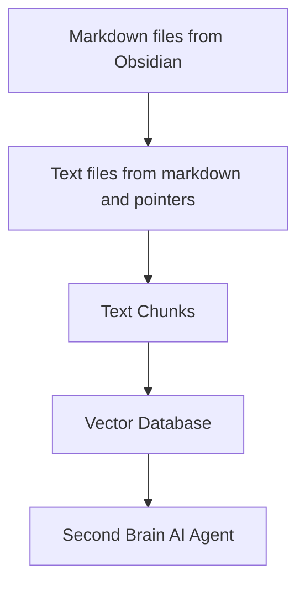

# 🧠 Second Brain AI agent

## Introducing the Second Brain AI Agent Project: Empowering Your Personal Knowledge Management

Are you overwhelmed with the information you collect daily? Do you often find yourself lost in a sea of markdown files, videos, web pages, and PDFs? What if there's a way to seamlessly index, search, and even interact with all this content like never before? Welcome to the future of Personal Knowledge Management: The Second Brain AI Agent Project.

### 📝 Inspired by Tiago Forte's Second Brain Concept

Tiago Forte's groundbreaking idea of the Second Brain has revolutionized the way we think about note-taking. It’s not just about jotting down ideas; it's about creating a powerful tool that enhances learning and creativity. Learn more about Building a Second Brain by Tiago Forte [here](https://fortelabs.com/blog/basboverview/).

### 💼 What Can the Second Brain AI Agent Project Do for You?

1. Automated Indexing: No more manually sorting through files! Automatically index the content of your markdown files along with contained links, such as PDF documents, YouTube videos, and web pages.

2. Smart Search Engine: Ask questions about your content, and our AI will provide precise answers, using the robust OpenAI Large Language Model. It’s like having a personal assistant that knows your content inside out!

3. Effortless Integration: Whether you follow the Second Brain method or have your own unique way of note-taking, our system seamlessly integrates with your style, helping you harness the true power of your information.

4. Enhanced Productivity: Spend less time organizing and more time innovating. By accessing your information faster and more efficiently, you can focus on what truly matters.

### ✅ Who Can Benefit?

* Professionals: Streamline your workflow and find exactly what you need in seconds.
* Students: Make study sessions more productive by quickly accessing and understanding your notes.
* Researchers: Dive deep into your research without getting lost in information overload.
* Creatives: Free your creativity by organizing your thoughts and ideas effortlessly.

### 🚀 Get Started Today

Don't let your notes and content overwhelm you. Make them your allies in growth, innovation, and productivity. Join us in transforming the way you manage your personal knowledge and take the leap into the future.

## Details

If you take notes using markdown files like in the Second Brain method or using your own way, this project automatically indexes the content of the markdown files and the contained links (pdf documents, youtube video, web pages) and allows you to ask question about your content using the OpenAI Large Language Model.

The system is built on top of the [LangChain](https://python.langchain.com/) framework and the [ChromaDB](https://www.trychroma.com/) vector store.

The system takes as input a directory where you store your markdown notes. For example, I take my notes with [Obsidian](https://obsidian.md/). The system then processes any change in these files automatically with the following pipeline:



From a markdown file, [transform_md.py](transform_md.py) extracts the text from the markdown file, then from the links inside the markdown file it extracts pdf, url, youtube video and transforms them into text.

From these text files, [transform_txt.py](transform_txt.py) breaks these text files into chunks, create a vector embeddings and then stores these vector embeddings into a vector database.

The second brain agent is using the vector database to answer questions about your documents using a large language model.

## Installation

You need a Python interpreter. All this has been tested with Python 3.11 under Fedora Linux 38. Let me know if it work for you on your system.

Get the source code:

```ShellSession
$ git clone https://github.com/flepied/second-brain-agent.git
```

Copy the example .env file and edit it to suit your settings:

```ShellSession
$ cp example.env .env
```

Install the dependencies using [poetry](https://python-poetry.org/):

```ShellSession
$ poetry install
```

There is a bug between poetry, torch and pypi, to workaround just do:

```ShellSession
$ poetry run pip install torch
```

Then to use the created virtualenv, do:

```ShellSession
$ poetry shell
```

### systemd services

To install systemd services to manage automatically the different scripts when the operating system starts, use the following command (need sudo access):

```ShellSession
$ ./install-systemd-services.sh
```

To see the output of the md and txt services:

```ShellSession
$ journalctl --unit=sba-md.service
$ journalctl --unit=sba-txt.service
```

### Doing a similarity search with the vector database

```ShellSession
$ ./similarity.py "What is LangChain?" type=note
```

### Launching the web UI

Launch this command to access the web UI:

```ShellSession
$ streamlit run second_brain_agent.py
  You can now view your Streamlit app in your browser.

  Local URL: http://localhost:8502
  Network URL: http://192.168.121.112:8502
```

Here is an example:


## Development

Install the extra dependencies using [poetry](https://python-poetry.org/):

```ShellSession
$ poetry install --with test
```

And then run the tests, like this:

```ShellSession
$ poetry run pytest
```

### pre-commit

Before submitting a PR, make sure to activate [pre-commit](https://pre-commit.com/):

```ShellSession
poetry run pre-commit install
```
