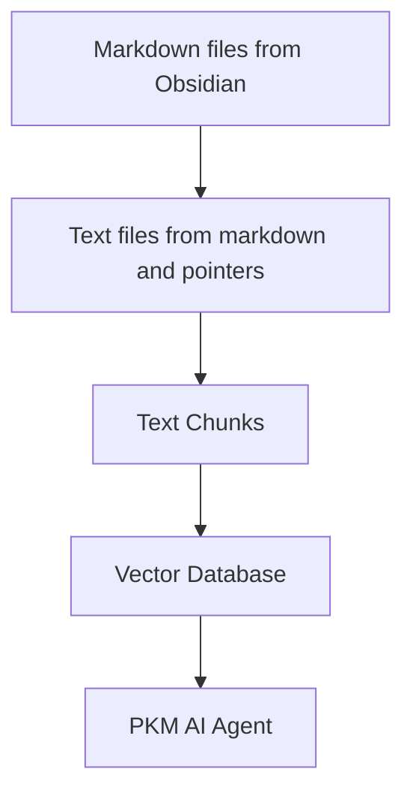

# Second Brain AI agent

The system takes as input a directory where you store your markdown notes for your second brain. For example I take my notes with [Obsidian](https://obsidian.md/). The system then processes any change in these files with the following pipeline:



From a markdown file, [transform_md.py](transform_md.py) extracts the text from the markdown file, then from the links inside the markdown file it extracts pdf, url, youtube video and transforms them into text.

From these text files, [transform_txt.py](transform_txt.py) breaks these text files into chunks, create a vector embeddings and then stores these vector embeddings into a vector database.

The second brain agent is using the vector database to answer questions about your documents using a large language model.

## Installation

You need a Python interpreter. All this has been tested with Python 3.11 under Fedora Linux 38. Let me know if it work for you on your system.

Get the source code:

```ShellSession
$ git clone https://github.com/flepied/second-brain-agent.git
```

Copy the example .env file and edit it to suit your settings:

```ShellSession
$ cp example.env .env
```

Install the dependencies using [poetry](https://python-poetry.org/):

```ShellSession
$ poetry install
```

There is a bug between poetry, torch and pypi, to workaround just do:

```ShellSession
$ poetry run pip install torch
```

Then to use the created virtualenv, do:

```ShellSession
$ poetry shell
```

### systemd services

To install systemd services to manage automatically the different scripts when the operating system starts, use the following command (need sudo access):

```ShellSession
$ ./install-systemd-services.sh
```

To see the output of the md and txt services:

```ShellSession
$ journalctl --unit=sba-md.service
$ journalctl --unit=sba-txt.service
```

### Doing a similarity search with the vector database

```ShellSession
$ ./similarity.py "What is LangChain?"
```

### Launching the web UI

Launch this command to access the web UI:

```ShellSession
$ streamlit run second_brain_agent.py
  You can now view your Streamlit app in your browser.

  Local URL: http://localhost:8502
  Network URL: http://192.168.121.112:8502
```

Here is an example:


## Development

Install the extra dependencies using [poetry](https://python-poetry.org/):

```ShellSession
$ poetry install --with test
```

And then run the tests, like this:

```ShellSession
$ poetry run pytest
```

### pre-commit

Before submitting a PR, make sure to activate [pre-commit](https://pre-commit.com/):

```ShellSession
poetry run pre-commit install
```
